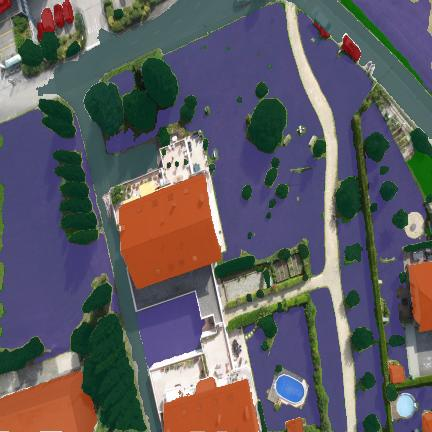
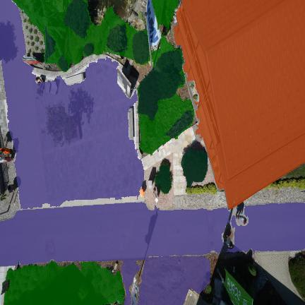
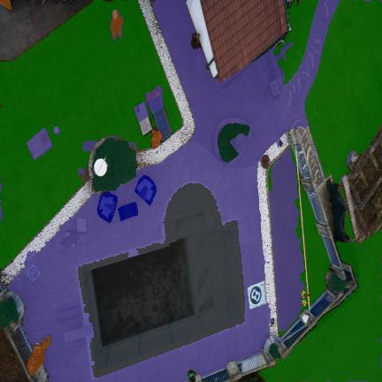

# Semantic Segmentation Dataset

This repository contains a high-quality, manually annotated dataset for Semantic Segmentation tasks. The annotations were meticulously created using **Roboflow**, ensuring precise pixel-level accuracy across a variety of complex object classes.

## 📊 Dataset Overview

This dataset was designed to help train state-of-the-art computer vision models for pixel-perfect object localization and semantic segmentation. 

- **Annotation Format:** PNG Masks for Semantic Segmentation
- **Source:** Manually annotated in Roboflow
- **Preprocessing:** Auto-orientation of pixel data, Resized to 432x432 (Stretch)

## 🎨 Annotation Quality & Classes

Great care was taken to perfectly outline objects in each image. Below is the mapping of pixel values in the `_mask.png` files to their respective object classes, along with the visualization color palette we use to verify the annotations.

| ID | Class Name | Visualization Color | ID | Class Name | Visualization Color |
|---|---|---|---|---|---|
| `0` | Background | Transparent | `9` | Container | Dark Blue |
| `1` | Car | Dark Red | `10` | Couch | Dark Maroon |
| `2` | Cow Statue | Dark Brown | `11` | Garage | Dark Slate Blue |
| `3` | Grass | Dark Green | `12` | Ground | Saddle Brown |
| `4` | House | Rust / Dark Orange | `13` | Person | Dark Magenta |
| `5` | Plants | Very Dark Green | `14` | Rail Track | Almost Black |
| `6` | Road | Dark Slate Gray | `15` | Swimming Pool | Dark Cyan |
| `7` | Dataset Label | Indigo / Purple | `16` | Table | Dark Goldenrod |
| `8` | Street | Charcoal | `17` | Umbrella | Goldenrod |

## 🖼️ Annotation Visualizations

To prove the accuracy of the manual annotations without needing to load the raw `.png` masks into a script, we've provided blended visual previews. The ground truth masks have been perfectly overlaid onto the original images using the color mapping above.

You can find all of the overlaid visualization checks in the `visualizations/` directory. Here are a few examples demonstrating the pixel-perfect quality of the masks:

  
  
  

## 🚀 Usage

The raw dataset images and their corresponding single-channel `_mask.png` files are located in the `train/` directory.

You can use these masks directly with PyTorch datasets or TensorFlow data pipelines by loading the mask with OpenCV or Pillow in grayscale mode (`L`), where the pixel intensity exactly matches the class `ID` shown in the table above.

---
*Generated & annotated via [Roboflow](https://roboflow.com).*
